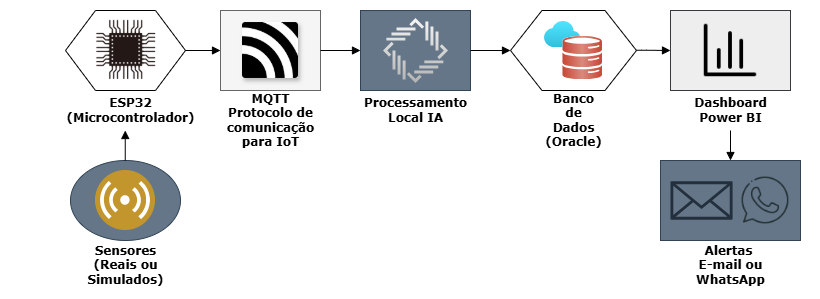

# HERMIA - Hermes Reply Intelligent Assistant

### FIAP - Faculdade de Informática e Administração Paulista

## 📅 **HERMIA - Sistema Inteligente de Prevenção de Falhas Industriais**

## 👥 Integrantes
- **Carlos** - RM566487
- **Endrew** - RM563646
- **João** - RM565999
- **Tayná** - RM562491
- **Vinicius** - RM566269

---

## 📄 Descrição
O projeto **HERMIA (Hermes Reply Intelligent Assistant)** é uma solução inteligente de manutenção preditiva voltada para ambientes industriais. Seu objetivo é monitorar continuamente variáveis operacionais críticas de máquinas — como temperatura, pressão e vibração — a fim de detectar anomalias em tempo real, antecipar falhas e recomendar ações preventivas com base em dados.

A proposta integra tecnologias de Internet das Coisas (IoT), protocolos de comunicação eficientes como o MQTT, algoritmos de Machine Learning e visualizações estratégicas via dashboards gerenciais. O sistema coleta dados por meio de sensores conectados ao microcontrolador ESP32, transmite essas informações para um broker MQTT e, em seguida, um script Python insere os dados em um banco Oracle para análise e tomada de decisão.

Com essa abordagem, o HERMIA permite a programação de manutenções preventivas em períodos de baixa demanda (como domingos ou turnos ociosos), evitando paradas inesperadas e reduzindo custos com intervenções corretivas. A meta é maximizar a disponibilidade dos ativos, aumentar a confiabilidade da produção e garantir uma gestão preditiva baseada em evidências — com potencial de reduzir a ocorrência de falhas inesperadas em até 100%.

---

## 🧱 Estrutura por Camadas

Para organizar o fluxo de dados e garantir eficiência operacional, o sistema HERMIA foi estruturado em cinco camadas interdependentes. Cada uma representa uma etapa crítica — da coleta de dados até a geração de alertas — permitindo escalabilidade, modularidade e facilidade de manutenção. A seguir, detalhamos como cada camada contribui para o funcionamento da solução.

HERMIA opera com sensores instalados em pontos estratégicos das máquinas industriais, que coletam dados em tempo real e os transmitem ao microcontrolador ESP32, atuando como nó de borda. Utilizando o protocolo MQTT, os dados são enviados via Wi-Fi a um broker local (Mosquitto), que os encaminha a um script Python responsável por armazená-los em um banco Oracle. Em seguida, algoritmos de machine learning aplicam análises sobre os dados históricos e em tempo real, identificando anomalias e prevendo falhas.

As informações são exibidas em dashboards interativos no Power BI e notificações são disparadas automaticamente via e-mail ou WhatsApp, permitindo decisões rápidas e baseadas em evidências. Projetado para ser escalável e seguro, o sistema suporta a adição de novos sensores e algoritmos, com autenticação no broker e controle de integridade dos dados. Em ambientes mais complexos, HERMIA pode evoluir para a nuvem (AWS IoT Core e EC2), garantindo maior disponibilidade e alinhamento com a Indústria 4.0.

### 1. Camada de Percepção
- Responsável pela coleta de dados em tempo real de pontos críticos das máquinas industriais.
- Dados monitorados serão definidos conforme os sensores fornecidos pela empresa. Possíveis variáveis:
  - Temperatura;
  - Pressão;
  - Vibração;
  - Outros dados a serem definidos.
- Frequência de coleta de dados adaptável de acordo com a necessidade de cada tipo de dado e sensor. 
- Localização dos Sensores: 
  - Pontos críticos das máquinas: motores, válvulas, rolamentos ou onde o dado possa ser captado com mais precisão.
- Os sensores estão conectados a um microcontrolador **ESP32**, que envia os dados via Wi-Fi.
- Caso haja desconexão, os dados são armazenados localmente em buffer e reenviados automaticamente.
- A confiabilidade será garantida por:
  - **Calibração inicial**: Sensores são ajustados antes da instalação para leituras precisas.
  - **Validação no ESP32**: O microcontrolador verifica valores inconsistentes (ex.: temperatura > 100°C ou vibração fora da faixa 1-10 Hz) e descarta leituras           inválidas antes do envio.
  - **Verificação no sistema**: Um script Python compara novos dados com faixas aceitáveis (baseadas em históricos) e sinaliza anomalias para revisão.
  - **Manutenção periódica**: Sensores serão recalibrados regularmente para evitar desvios.

### 2. Camada de Comunicação
Esta camada é responsável pela transmissão segura, modular e eficiente dos dados coletados pelos sensores até a camada de processamento. O microcontrolador ESP32 utiliza o protocolo MQTT para enviar os dados em tempo real a um broker local (Mosquitto), que os repassa a um script Python assinante. Este, por sua vez, insere os dados no banco de dados Oracle. A arquitetura garante baixa latência, escalabilidade e resiliência, além de permitir expansão futura para soluções em nuvem.

⚙️ Tecnologias utilizadas:
- ESP32 como nó IoT para leitura e envio dos dados;
- Protocolo MQTT, leve e otimizado para redes IoT;
- Broker local Mosquitto para gerenciamento inicial das mensagens;
- Script Python com biblioteca paho-mqtt atuando como cliente assinante;
- Banco de dados Oracle como destino dos dados recebidos.

✅ Vantagens do uso do MQTT:
- Baixo consumo de banda e energia;
- Comunicação desacoplada (publish/subscribe), promovendo modularidade;
- Suporte nativo a comunicação assíncrona e escalável;
- Resiliência: o ESP32 pode armazenar dados temporariamente (buffer) em caso de falha de conexão;
- Comunicação bidirecional: permite enviar comandos ao ESP32 (ex.: alterar frequência de leitura).

🔐 Segurança e evolução futura:
- Autenticação por usuário e senha no broker MQTT;
- Planejamento para migração futura para AWS IoT Core, que oferece escalabilidade, segurança avançada e integração com serviços de nuvem.

### 3. Camada de Processamento
Esta camada é responsável por armazenar, organizar e analisar os dados recebidos da camada de comunicação, aplicando técnicas de inteligência artificial para prever falhas e identificar comportamentos anômalos em tempo real. O processamento será feito localmente, utilizando scripts Python com bibliotecas especializadas. Os dados são persistidos em um banco de dados Oracle, estruturados de forma relacional para garantir integridade e eficiência em consultas analíticas.

🗂️ Estrutura de Armazenamento:
- Banco de dados Oracle (versão gratuita) como solução inicial.
- Armazenamento em tabelas normalizadas, com colunas:
    - "timestamp": "AAAA-MM-DD HH:MM:SS",
    - "sensor_id": "ID_do_Sensor",
    - "sensor_type": "Temperatura|Pressão|Vibração|Corrente|Velocidade|OUTRO",
    - "value": 123.45,
    - "status": "normal|anômalo"
        
- Suporte a índices e consultas eficientes para análise preditiva.

🧪 Processamento e IA:
- O processamento será feito localmente, com possibilidade futura de migração para serviços em nuvem como AWS EC2.
- Linguagem utilizada: Python
- Bibliotecas: Scikit-learn, PyCaret, Pandas, Prophet, Statsmodels

🤖 Modelos e técnicas de IA aplicadas:
- **Prophet**: previsão de séries temporais para identificar tendências operacionais;
- **Isolation Forest**: detecção de anomalias multivariadas em tempo real;
- **Random Forest**: classificação de padrões de falha com alta acurácia.

🔁 Ciclo de aprendizado:
- Modelos treinados com dados simulados, previamente normalizados e validados.
- Divisão treino/teste com validação cruzada.
- Processo contínuo de melhoria baseado em novos dados históricos e feedback das ações realizadas.

### 4. Camada de Aplicação
Esta camada é responsável pela interface entre o sistema e os usuários, transformando os dados processados em informações visuais de fácil interpretação. Utilizando dashboards desenvolvidos no Power BI, o sistema apresenta status em tempo real, análises históricas e previsões de falhas. Essa visualização estratégica permite a tomada de decisões ágeis tanto em nível operacional quanto gerencial.

📊 Tipos de dashboards:
- Operacional: apresenta o status em tempo real dos principais indicadores das máquinas, com uso de cores semafóricas (verde, amarelo, vermelho) para facilitar o monitoramento por operadores.
- Gerencial: fornece análise de séries históricas, tendências, KPIs, relatórios detalhados e previsões de falha, voltado para gestores e supervisores.

🔄 Atualização e acesso:
- Atualização automática: a cada 1 minuto no protótipo, podendo ser contínua em ambiente produtivo.
- Acesso local inicialmente, com possibilidade de migração para Power BI Service para visualização remota e multiplataforma.

🧑‍💻 Experiência do Usuário (UX):
- Interface limpa e intuitiva, com ícones coloridos, gráficos interativos e alertas visuais destacados.
- Opções avançadas de análise para gestores, incluindo filtros personalizados, exportação de relatórios e insights automatizados.
- Design pensado para acessibilidade, com bom contraste e organização visual.

### 5. Camada de Ação
Esta camada final é responsável por transformar as análises do sistema em ações práticas. Quando uma anomalia é detectada pelos modelos de IA, o sistema aciona um mecanismo de notificação automatizada, informando as equipes responsáveis e sugerindo medidas corretivas. O objetivo é antecipar falhas, evitar prejuízos e aumentar a confiabilidade operacional.

🔔 Geração de alertas:
- Identificação de comportamentos anômalos com base nos dados em tempo real.
- Geração automática de alertas visuais nos dashboards e envio de notificações via e-mail ou WhatsApp.
- Registro completo dos alertas no banco Oracle: timestamp, variável afetada, valor registrado, ação recomendada e ação realizada.

🛠️ Ações recomendadas:
- Redução da carga de trabalho do equipamento;
- Agendamento de manutenção preventiva;
- Desligamento temporário da máquina em casos críticos.

📅 Previsão de falhas:
- O sistema é capaz de prever falhas com até alguns dias de antecedência, com base em padrões históricos e tendências detectadas.
- Essa capacidade permite planejamento proativo de intervenções durante períodos de menor impacto operacional.

🔄 Evolução futura:
- Integração com sistemas de controle automatizado (ex: CLPs) para que, em situações críticas, o sistema possa executar respostas automáticas (como desligamento da máquina).
- Implementação de notificações por SMS ou push.
- Inclusão de um módulo de feedback do operador para avaliação da efetividade das recomendações.

---

### Diagrama estrutural 

  

---

## 🛠️ Tecnologias Utilizadas
- **Hardware:** ESP32, sensores industriais.
- **Linguagem:** Python, com bibliotecas Scikit-learn, PyCaret, Pandas, Prophet, IsolationForest.
- **Protocolos:** MQTT.
- **Broker MQTT (Inicial):** Mosquitto.
- **IA:** Prophet, Isolation Forest, Random Forest, Scikit-learn, PyCaret.
- **Banco de Dados:** Oracle (possível migração futura para PostgreSQL ou AWS RDS).
- **Visualização:** Power BI.
- **Serviços de Mensagens:** WhatsApp (via API) ou e-mail.

---

## 🚀 Próximos Passos
- Definir os sensores reais e as variáveis que serão monitoradas.
- Criar e testar o protótipo funcional da comunicação MQTT.
- Implementar o broker MQTT e configurar os parâmetros de segurança.
- Criar o banco de dados Oracle e populá-lo com dados coletados.
- Desenvolver e treinar os modelos de IA para detecção de anomalias e previsão de falhas.
- Testar os modelos com dados simulados para validação inicial.
- Desenvolver dashboards interativos e configurar sua atualização em tempo real.
- Implementar o sistema de alertas automáticos e recomendações preventivas.
- Documentar os testes, aprendizados e resultados obtidos.

